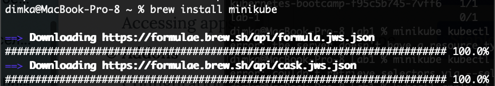
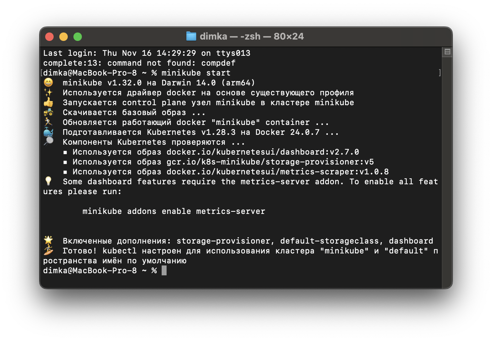
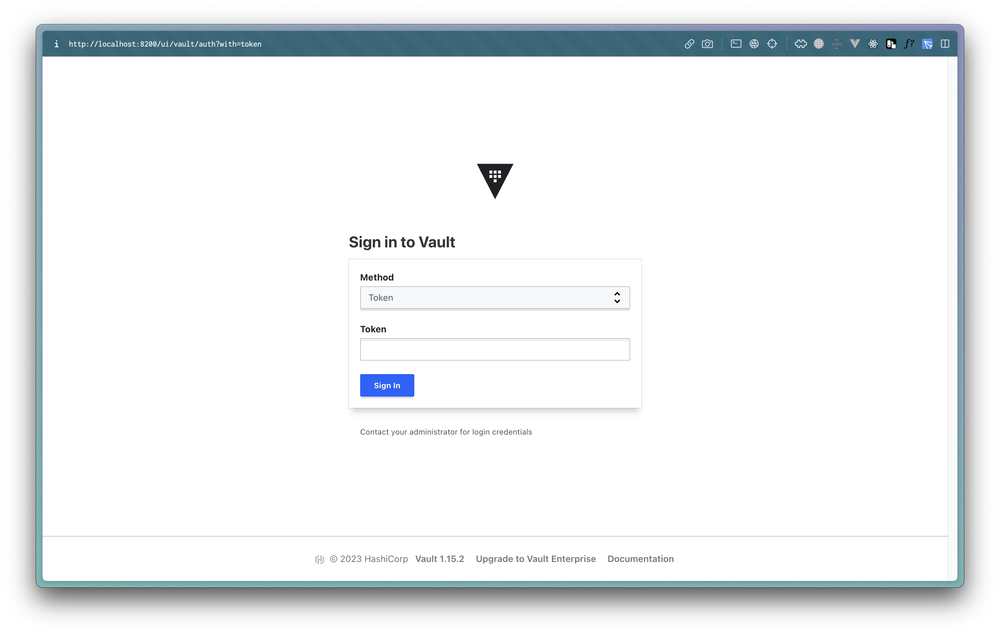
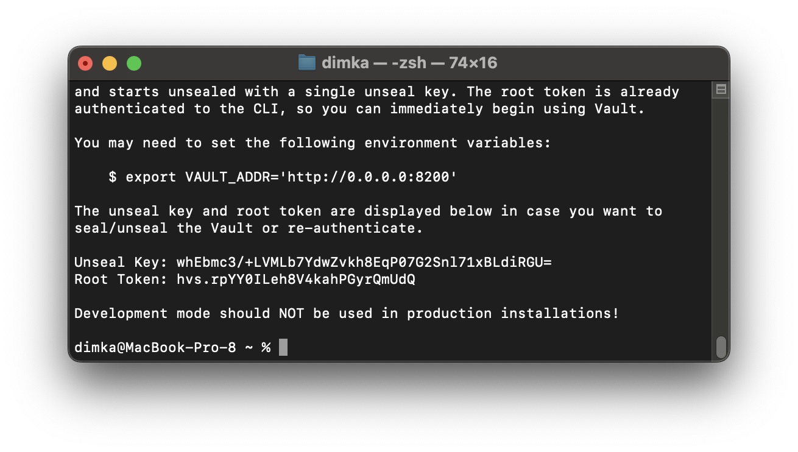
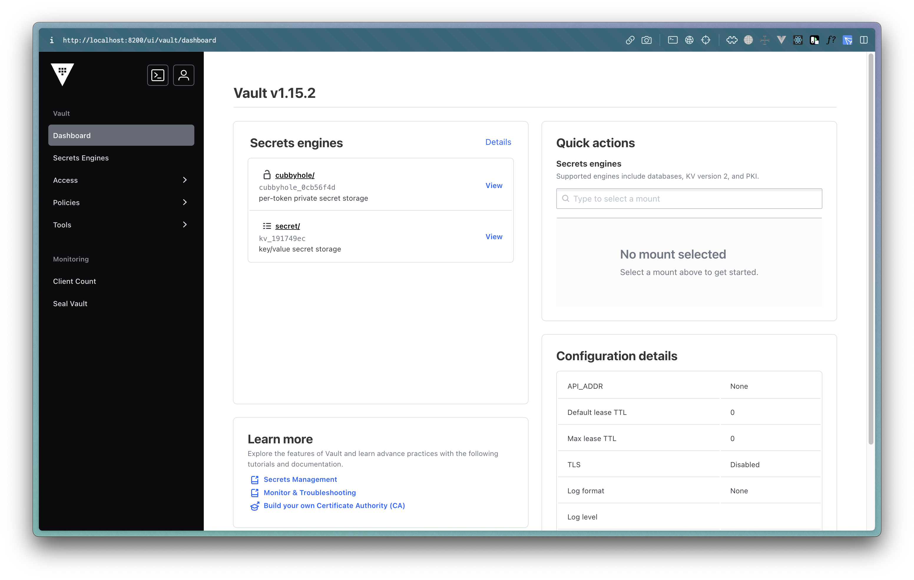

University: [ITMO University](https://itmo.ru/ru/)  
Faculty: [FICT](https://fict.itmo.ru)  
Course: [Introduction to distributed technologies](https://github.com/itmo-ict-faculty/introduction-to-distributed-technologies)  
Year: 2023/2024  
Group: K4113s  
Author: Shitov Dmitry Romanovich  
Lab: Lab1  
Date of create: 16.10.2023  
Date of finished: 16.10.2023

## Лабораторная работа №1 "Установка Docker и Minikube, мой первый манифест."

### Описание

Это первая лабораторная работа в которой вы сможете протестировать Docker, установить Minikube и развернуть свой первый "под".

### Цель работы

Ознакомиться с инструментами Minikube и Docker, развернуть свой первый "под".

### Ход работы

- Докер уже был установлен на ПК, поэтому перехожу к установке Minikube

- Установить Minikube решил с использованием Homebrew
  

- Разворачиваю Minicube cluster
  

- Создаю манифест для пода с контейнером vault внтури с портом 8200

```yaml
apiVersion: v1
kind: Pod
metadata:
  name: lab-1
  labels:
    app: vault
spec:
  containers:
    - name: vault
      image: vault:1.13.3
      ports:
    	- containerPort: 8200
```

- Создаю под на основе манифеста

```bash
kubectl apply -f vault.yaml
```

- Проверяю успешность

```bash
kubectl get pods
```

- Создаю сервис для связи с подом

```bash
minikube kubectl -- expose pod lab-1 --type=NodePort --port=8200
```

- Пробрасываю порт для доступа к поду извне

```bash
minikube kubectl -- port-forward service/lab-1 8200:8200
```

- Захожу на http://localhost:8200



- Для нахождения токена смотрю логи vault

```bash
kubectl logs lab-1
```



- Копирую токен и зажожу


