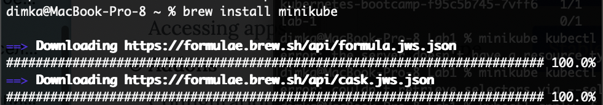

University: [ITMO University](https://itmo.ru/ru/)
Faculty: [FICT](https://fict.itmo.ru)
Course: [Introduction to distributed technologies](https://github.com/itmo-ict-faculty/introduction-to-distributed-technologies)
Year: 2023/2024
Group: K66666
Author: Filianin Ivan Victorovich
Lab: Lab1
Date of create: 20.09.2023
Date of finished: 31.09.2023

## Лабораторная работа №1 "Установка Docker и Minikube, мой первый манифест."

### Описание

Это первая лабораторная работа в которой вы сможете протестировать Docker, установить Minikube и развернуть свой первый "под".

### Цель работы

Ознакомиться с инструментами Minikube и Docker, развернуть свой первый "под".

### Ход работы

- Докер уже был установлен на ПК, поэтому перехожу к установке Minikube

- Установить Minikube решил с использованием Homebrew
  
