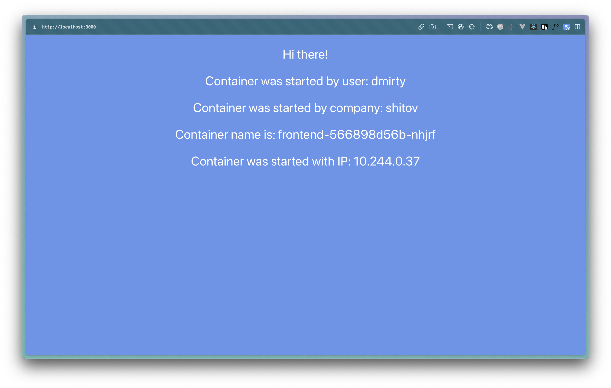
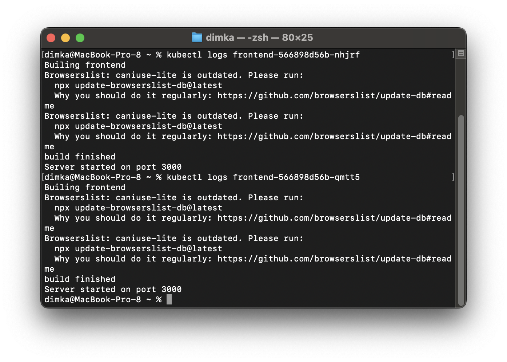
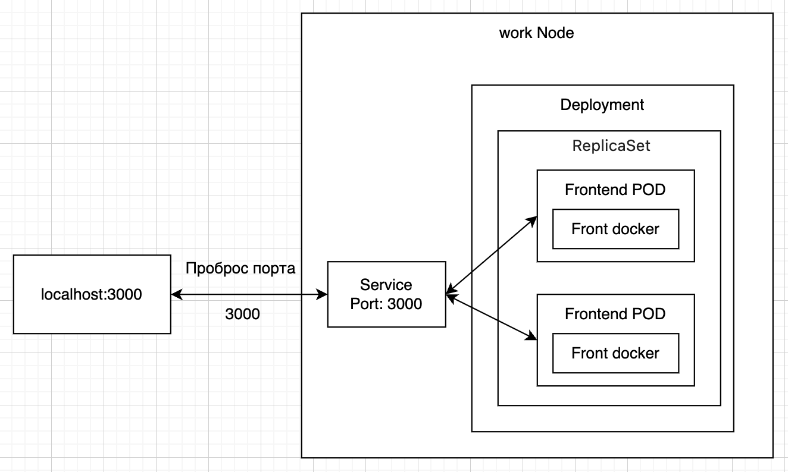

University: [ITMO University](https://itmo.ru/ru/)  
Faculty: [FICT](https://fict.itmo.ru)  
Course: [Introduction to distributed technologies](https://github.com/itmo-ict-faculty/introduction-to-distributed-technologies)  
Year: 2023/2024  
Group: K4113s  
Author: Shitov Dmitry Romanovich  
Lab: Lab1  
Date of create: 16.10.2023  
Date of finished: 16.10.2023

## Лабораторная работа №2 "Развертывание веб сервиса в Minikube, доступ к веб интерфейсу сервиса. Мониторинг сервиса."

### Описание

В данной лабораторной работе вы познакомитесь с развертыванием полноценного веб сервиса с несколькими репликами.

### Цель работы

Ознакомиться с типами "контроллеров" развертывания контейнеров, ознакомится с сетевыми сервисами и развернуть свое веб приложение.

### Ход работы

- Создал `deployment` с 2 репликами контейнера и передать переменные в эти реплики: `REACT_APP_USERNAME`, `REACT_APP_COMPANY_NAME` с помощью манифеста `frontend.yaml`.

```yaml
apiVersion: apps/v1
kind: Deployment
metadata:
  name: frontend
spec:
  replicas: 2
  selector:
    matchLabels:
      app: frontend
  template:
    metadata:
      labels:
        app: frontend
    spec:
      containers:
        - name: frontend
          image: ifilyaninitmo/itdt-contained-frontend:master
          env:
            - name: REACT_APP_USERNAME
              value: dmirty
            - name: REACT_APP_COMPANY_NAME
              value: shitov
          ports:
            - containerPort: 3000
```

```bash
kubectl apply -f frontend.yaml
```

- Cервис для доступа на эти "поды" - node port. Создадим его.

```yaml
apiVersion: v1
kind: Service
metadata:
  name: node-port
spec:
  type: NodePort
  ports:
    - port: 3000
      targetPort: 3000
      protocol: TCP
      name: http
  selector:
    app: frontend
```

```bash
kubectl apply -f nodePort.yaml
```

- Запустил в `minikube` режим проброса портов и подключился к контейнерам через веб-браузер.

```bash
kubectl port-forward service/node-port 3000:3000
```



- В веб браузере переменные `REACT_APP_USERNAME`, `REACT_APP_COMPANY_NAME` и `Container name` не изменяются.

- Ввиду идентичности контенеров(помним что они реплики) логи контейнеров так же идентичны.
  

- Схема организации контейеров и сервисов данной лабораторной
  
