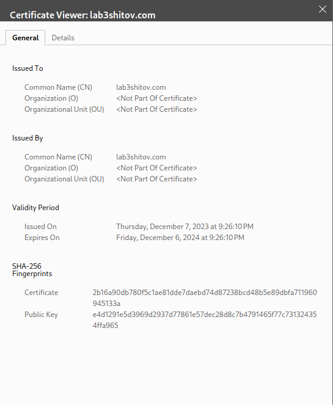

University: [ITMO University](https://itmo.ru/ru/)  
Faculty: [FICT](https://fict.itmo.ru)  
Course: [Introduction to distributed technologies](https://github.com/itmo-ict-faculty/introduction-to-distributed-technologies)  
Year: 2023/2024  
Group: K4113s  
Author: Shitov Dmitry Romanovich  
Lab: Lab3  
Date of create: 7.12.2023  
Date of finished: 7.12.2023

## Лабораторная работа №3 "Сертификаты и "секреты" в Minikube, безопасное хранение данных."

### Описание

В данной лабораторной работе вы познакомитесь с сертификатами и "секретами" в Minikube, правилами безопасного хранения данных в Minikube.

### Цель работы

Познакомиться с сертификатами и "секретами" в Minikube, правилами безопасного хранения данных в Minikube.

### Ход работы

-   Создал config map для передачи переменных окружения

```yaml
apiVersion: v1
kind: ConfigMap
metadata:
    name: config-map
data:
    REACT_APP_USERNAME: "Dmitry"
    REACT_APP_COMPANY_NAME: "Shitov"
```

-   Создал `deployment` с 2 репликами контейнера и передать переменные в эти реплики: `REACT_APP_USERNAME`, `REACT_APP_COMPANY_NAME` с помощью config map.

```yaml
apiVersion: apps/v1
kind: Deployment
metadata:
    name: frontend
spec:
    replicas: 2
    selector:
        matchLabels:
            app: frontend
    template:
        metadata:
            labels:
                app: frontend
        spec:
            containers:
                - name: frontend
                  image: ifilyaninitmo/itdt-contained-frontend:master
                  envFrom:
                      - configMapRef:
                            name: config-map
                  ports:
                      - containerPort: 3000
                        name: http
```

-   Cервис для доступа на эти "поды" - node port. Создадим его.

```yaml
apiVersion: v1
kind: Service
metadata:
    name: node-port
spec:
    type: NodePort
    ports:
        - port: 3000
          targetPort: 3000
          protocol: TCP
          name: http
    selector:
        app: frontend
```

-   Далее для генерации ключа буду использовать OpenSSL, для этого используя Brew устанавливаю LibreSSL (напрямую OpenSSL не поставить). LibreSSL в настоящее время совместим с OpenSSL и работает, но, LibreSSL не определяется автоматически, поэтому Allegro CL необходимо сообщить, какая версия OpenSSL установлена.

```bash
export ACL_OPENSSL_VERSION=11
```

-   После устанавливаю OpenSSL:

```bash
brew install openssl
```

-   Генерирую ключ:

```bash
openssl req -x509 -sha256 -nodes -days 365 -newkey rsa:2048 -keyout tls.key -out tls.crt
```

-x509 — уточнение, что нам нужен именно самоподписанный сертификат;
-newkey — автоматическое создание ключа сертификата;
-days — срок действия сертификата в днях;
-keyout — путь (если указан) и имя файла ключа;
-out — путь (если указан) и имя файла сертификата.


-   Далее импортирую сертификат в minikube:

```bash
kubectl -n kube-system create secret tls mkcert --key tls.key --cert tls.crt
```

-   Активирую и конфигурирую аддон ingress в minikube

```bash
minikube addons configure ingress
-- Enter custom cert(format is "namespace/secret"): kube-system/mkcert
```

-   Созадю ingress

```yaml
apiVersion: networking.k8s.io/v1
kind: Ingress
metadata:
    name: front-ingress
spec:
    rules:
        - host: lab3shitov.com
          http:
              paths:
                  - path: /
                    pathType: Prefix
                    backend:
                        service:
                            name: node-port
                            port:
                                number: 3000
```


-   Далее прописываю в host пару `192.168.49.2` `lab3shitov.com`

-   Перехожу по ссылке http://lab3shitov.com
    
    

-   Проверка сертификата


