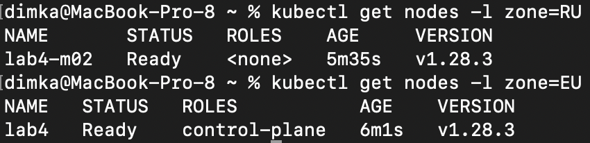
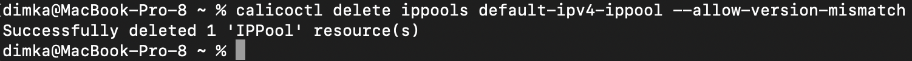

University: [ITMO University](https://itmo.ru/ru/)  
Faculty: [FICT](https://fict.itmo.ru)  
Course: [Introduction to distributed technologies](https://github.com/itmo-ict-faculty/introduction-to-distributed-technologies)  
Year: 2023/2024  
Group: K4113s  
Author: Shitov Dmitry Romanovich  
Lab: Lab4  
Date of create: 7.12.2023  
Date of finished: 7.12.2023

## Лабораторная работа №4 "Сети связи в Minikube, CNI и CoreDNS"

### Описание

Это последняя лабораторная работа в которой вы познакомитесь с сетями связи в Minikube. Особенность Kubernetes заключается в том, что у него одновременно работают underlay и overlay сети, а управление может быть организованно различными CNI.

### Цель работы

Познакомиться с CNI Calico и функцией IPAM Plugin, изучить особенности работы CNI и CoreDNS.

### Ход работы

-   Запускаю minikube с плагином calico

```bash
minikube start --network-plugin=cni --cni=calico
```

-   Запускаю кластер с двумя узлами

```bash
minikube start --nodes 2 -p lab4
```

-   Проверяю состояние

```bash
kubectl get pod
kubectl get pod -l k8s-app=calico-node -A
```


-   Помечаю ноды лейблами

```bash
kubectl get nodes -l zone=RU
kubectl get nodes -l zone=EU
```



-   Удаляю стандартный IPPool

```bash
calicoctl delete ippools default-ipv4-ippool --allow-version-mismatch
```



-   Создаю манифест для IPPool-ов

```yaml
apiVersion: projectcalico.org/v3
kind: IPPool
metadata:
    name: central-ippool
spec:
    cidr: 192.168.0.0/24
    ipipMode: Always
    natOutgoing: true
    nodeSelector: zone == "RU"
---
apiVersion: projectcalico.org/v3
kind: IPPool
metadata:
    name: east-ippool
spec:
    cidr: 192.168.1.0/24
    ipipMode: Always
    natOutgoing: true
    nodeSelector: zone == "EU"
```


-   Проверка

```bash
calicoctl get ippool -o wide --allow-version-mismatch
```


-   Используем наработки лабы 3

```yaml
apiVersion: v1
kind: ConfigMap
metadata:
    name: config-map
data:
    REACT_APP_USERNAME: "Dmitry"
    REACT_APP_COMPANY_NAME: "Shitov"
---
apiVersion: apps/v1
kind: Deployment
metadata:
    name: frontend
spec:
    replicas: 2
    selector:
        matchLabels:
            app: frontend
    template:
        metadata:
            labels:
                app: frontend
        spec:
            containers:
                - name: frontend
                  image: ifilyaninitmo/itdt-contained-frontend:master
                  envFrom:
                      - configMapRef:
                            name: config-map
                  ports:
                      - containerPort: 3000
                        name: http
---
apiVersion: v1
kind: Service
metadata:
    name: node-port
spec:
    type: NodePort
    ports:
        - port: 3000
          targetPort: 3000
          protocol: TCP
          name: http
    selector:
        app: frontend
```

-   Проверяем

```bash
kubectl get pod -o wide
```


-   Пробрасываем порты

```bash
kubectl port-forward service/node-port 3000:3000
```

-   Заходим с проверкой на 127.0.0.1:3000


-   В веб браузере переменные REACT_APP_USERNAME, REACT_APP_COMPANY_NAME и Container name не изменяются потому что сервис не LoadBalancer, а nodePort.

-   Схема
    
